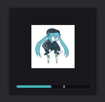

# soviet-polkka-indicator
Soviet Polkka Sound Indicator for GNOME. 
All sound levels are same. 

### First Step:  
`sudo git clone https://github.com/Comrade-Otaku/soviet-polkka-indicator/`   
### Second Step: 
(Replace `youricontheme` with your icon theme's name. If scalable/status doesn't exist, then idk what to do.) 
`cp -rf soviet-polkka-indicator/*.svg /usr/share/icons/youricontheme/scalable/status/`   
### Third Step: 
Run ALT+F2 and run the command  `r`. If you are using Wayland, you have to logout and login.   
I have edited the image a little. Original image: [@mikumiku_ebooks](https://twitter.com/mikumiku_ebooks/status/1016702528224923650)
